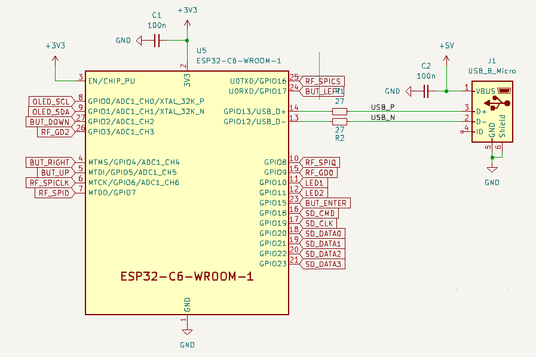
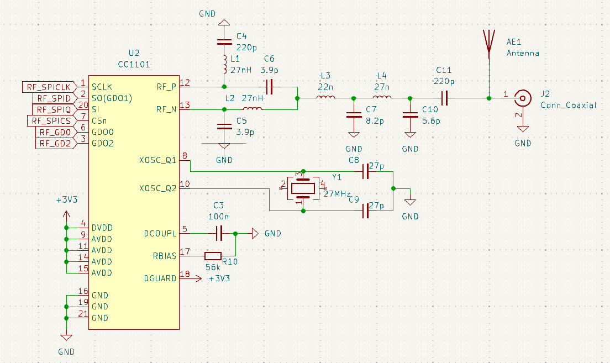
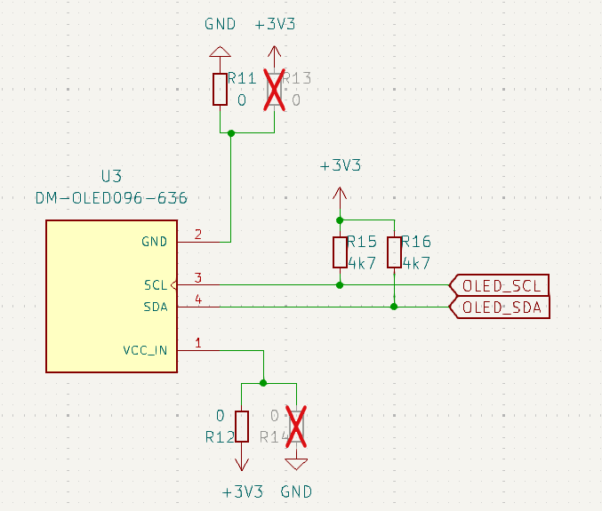
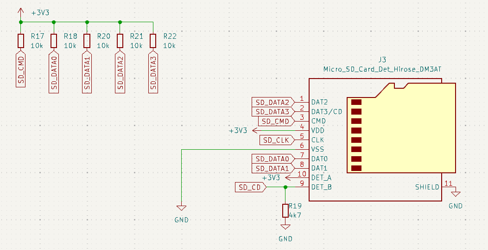
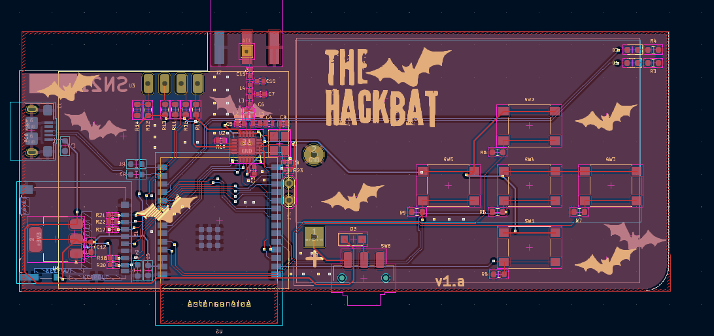
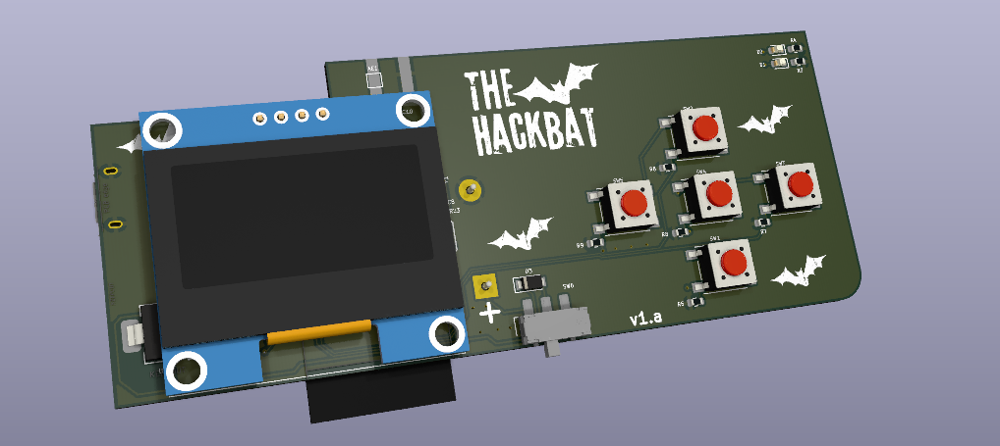
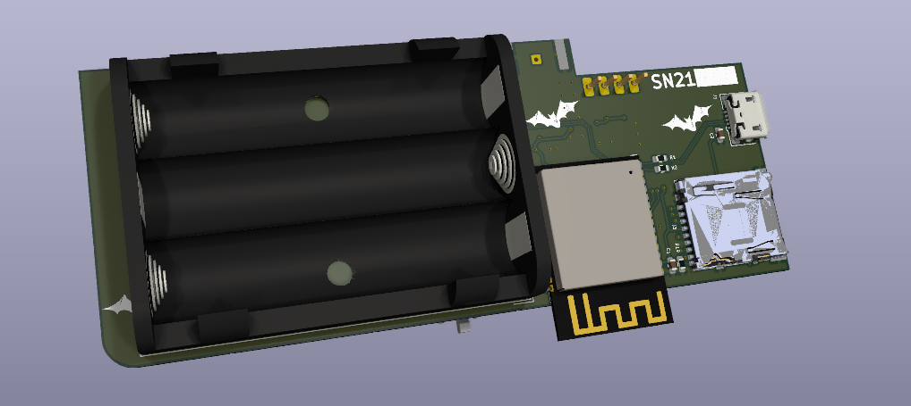
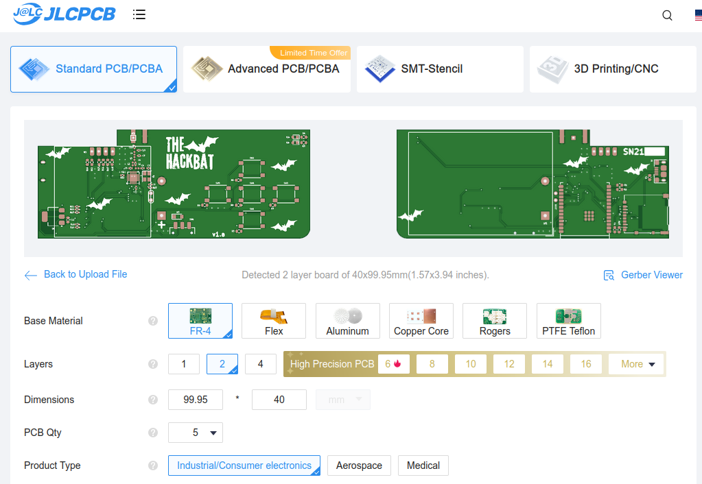

# HACKBAT ESP32 

New version of the Hackbat tool, this time based on the ESP32 C6. 

> NOTE: This version is still under test, so minor changes can be applied.

## The CPU

The new version of hackbat features a powerful [ESP32C6](https://www.espressif.com/en/products/socs/esp32-c6) from [Espressif](https://www.espressif.com). This microcontroller features a dual core RISC-V processor, WIFI6, BT LE and a bunch of peripherals. 

The package used is the WROOM-1, but it is also compatible with the 1U model adding an external antenna.

## RF

Like the original, the Hackbat ESP32 features an RF tranceiver, the [CC1101](https://www.ti.com/product/es-mx/CC1101) from Texas Instruments. 

The CC1101 is a low-cost sub-1 GHz transceiver designed for very low-power wireless applications. The circuit is mainly intended for the ISM (Industrial, Scientific and Medical) and SRD (Short Range Device) frequency bands at 315, 433, 868, and 915 MHz, but can easily be programmed for operation at other frequencies in the 300-348 MHz, 387-464 MHz and 779-928 MHz bands

The Hackbat ESP32 board includes an antenna, but can be also populate the J2 connector in order to add an SMA antenna.

## OLED

A monochrome OLED is added as an interface. The driver used in the ESP-IDF IDE is able to work with the SH1106, and ssd1306

## SDCard

The SD Card in this version uses the SDIO interface with the microcontroller, so the speed is increased with respect the first version of the board.

## Layout

The layout of the board is 2-layer with components in both layers.

## Get yours

This project is open-source so you can build your own Hackbat by sending the production files to [JLCPCB](https://jlcpcb.com/?from=controlpath).

[JLCPCB](https://jlcpcb.com/?from=controlpath) not only will manufacture your PCB, but they can also asembly your board. To do that, you have to use the BOM and the Centroid files provided in the [`production_files`](./kicad/production_files/) folder.

Remember to change the Surface Finish to LeadFree HASL to make your board ROHS compliant. Also, the original board uses a Black PCB color, so if you want to keep your Hackbat like the original, you can select this color to be sure that the silkscreen is seen correctly.

In a few days, you will receive your board at home.